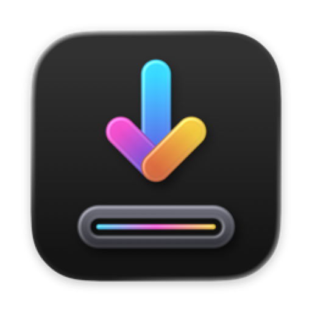

  

<h1 align="center">Relente</h1>

  
  
  

Relente is a native Mac app that creates a bootable USB drive from a macOS installer, so you can do a clean install of macOS. It wraps Apple's own `createinstallmedia` tool in a guided, visual flow: pick an installer, pick a USB drive, review, and create.

It is written in Swift and SwiftUI, and only works with macOS installers and removable drives (USB drives and SD cards). Internal disks and external SSDs or hard drives are never offered as a destination.

> [!WARNING]
> Relente is in early development and is **not usable yet**. When it is, it will **erase** the drive you choose. Always double-check the drive before confirming.

## Get started

### Requirements

- A Mac running **macOS 14 Sonoma** or later, with Apple silicon or an Intel processor. Older Macs matter here, so the oldest supported version is only dropped when keeping it becomes costly; this is reviewed once a year.
- A macOS installer from **Big Sur (11) onwards**, in any of these forms:
  - `Install macOS <name>.app`
  - A `.dmg` that contains the installer app
  - `InstallAssistant.pkg`
- A USB drive or SD card of at least 16 GB. Everything on it will be erased.

### Install

There are no releases yet. Signed and notarized builds will be published on the [Releases](../../releases) page.

To build it yourself, see [BUILDING.md](BUILDING.md).

### Create a bootable USB drive

1. Open Relente. The first time, it asks you to approve its system helper, which is the part that formats the drive.
2. **Installer:** choose one of the macOS installers found on your Mac, or download one from Apple.
3. **USB drive:** choose the drive to use. Drives that are too small are marked.
4. **Review:** check what will be erased, confirm, and authenticate with Touch ID or your password.
5. **Creating:** wait until the drive is formatted, copied, made bootable and verified.

When it's done, the app explains how to start up from the drive on a Mac with Apple silicon or with an Intel processor. Apple's guide [Create a bootable installer for macOS](https://support.apple.com/en-us/101578) covers the same steps from the command line.

### Uninstall

1. In Relente, remove the system helper from the app's settings. (You can also turn it off in **System Settings → General → Login Items & Extensions**.)
2. Move Relente to the Trash.

## How it works

Relente has two parts:

- **The app** runs without special privileges. It shows the interface, finds macOS installers, and detects removable drives.
- **A small system helper** runs as root, registered through `SMAppService`. It only knows how to do three things: format a drive, run `createinstallmedia`, and report progress. It has no network access and accepts requests only from the signed Relente app.

Before erasing anything, the helper checks on its own that the drive is external and removable, that it is not the startup disk, that it's the same drive you confirmed, and that the installer is signed by Apple. See [SECURITY.md](SECURITY.md) for details.

## Contributing

This is a personal project and **pull requests aren't accepted for now**. Bug reports and ideas are welcome as [issues](../../issues). See [CONTRIBUTING.md](CONTRIBUTING.md).

## Project status

Early development. The roadmap (specs refer to these as "roadmap step N"):

1. [x] Project setup
2. [x] Folder structure and design system
3. [x] Static screens with sample data: 001 Installer ✓, 002 USB drive ✓, 003 Review ✓, 004 Creating (+ Error) ✓, 005 Done ✓
4. [x] Assistant navigation and animations: 006 Assistant navigation ✓
5. [x] Real disk and installer detection: 007 Real detection ✓
6. [ ] System helper, XPC and security checks (includes the Permissions screen)
7. [ ] `createinstallmedia` with live progress
8. [ ] Signing, notarization and first release
9. [ ] Download installers from Apple (Download screen)

Relente is built with spec-driven development: every feature has a specification in [`specs/`](specs), and the project's rules are in [AGENTS.md](AGENTS.md).

## License

Relente is released under the [MIT License](LICENSE).

Relente is not affiliated with or endorsed by Apple. macOS is a trademark of Apple Inc.
